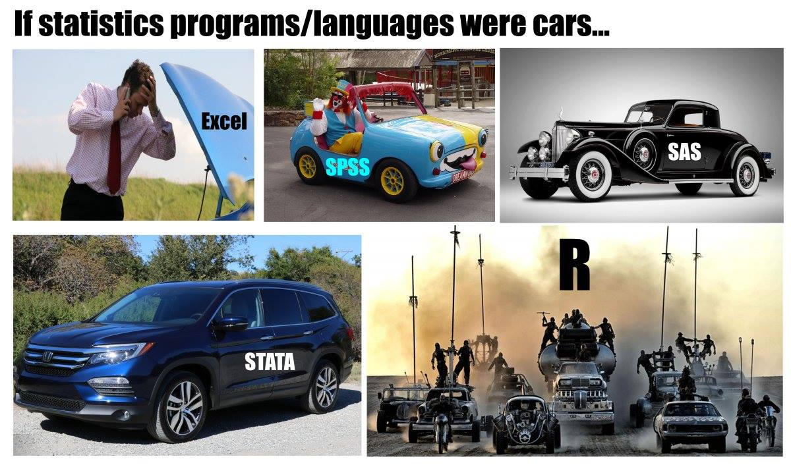
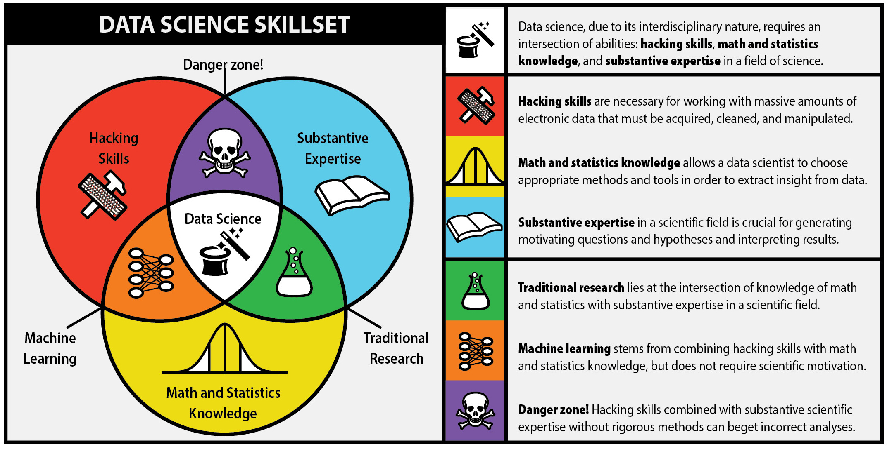

# Introducción a R

## ¿Qué es R?





### Algo de historia de R

  * R es el hermano de S
  * S es un lenguaje de programación estadística desarrollado por John Chambers de Bell Labs
  * El objetivo de S era “convertir las ideas en el software, de forma rápida y fielmente”
  * S fue creado en 1976 y se reinvento 1988 introduciendo muchos cambios
  * En 1993, StatSci (fabricante de S-Plus) adquieren licencia exclusiva a S
  * S-Plus integra S con una interfaz gráfica de usuario agradable y pleno apoyo al cliente
  * R Fue creado por Ross Ihaka y Robert Gentleman de la University of Auckland, New Zealand

### Acerca de R

  * El proyecto R inicio en 1991
  * R apareció por primera vez en 1996 como un software de código abierto!
  * Altamente personalizable a través de paquetes
  * La comunidad R, se basa en el poder de la colaboración con miles de paquetes de libre disposición
  * Existen muchas interfaces gráficas de usuario de R libres y comerciales (por ejemplo R Studio y Revolución)

### ¿Qué es R?

R es un conjunto integrado de servicios de software para la manipulación de datos, cálculo y representación gráfica. Incluye:

  * instalación sencilla y un fácil almacenamiento de datos
  * un conjunto de operadores para los cálculos en arrays, particularmente en las matrices
  * facilidad en los gráficos y el análisis de datos y
  * bien desarrollado, lenguaje de programación sencillo y eficaz que incluye condicionales, bucles, funciones recursivas definidos por el usuario.
  * Altamente intuitivo

> A pesar de ser libre y de código abierto, R es ampliamente utilizado por los analistas de datos dentro de las empresas y el mundo académico. (R en the NY Times)
Ver [NY Times](https://www.nytimes.com/2009/01/07/technology/business-computing/07program.html?pagewanted=all&_r=0) artículo.

### Algunas referencias

  - https://cran.r-project.org/
  - 

## RStudio

RStudio es un ambiente libre y abierto de desarrollo de código integrado.

  * multiplataforma
  * El resaltado de sintaxis, completado de código, y la sangría inteligente
  * gestionar fácilmente múltiples directorios de trabajo
  * Flexible para el manejo de gráficos
  * Integrado con Knitr
  * Integrado con Git
  
## Instalación

  * R-CRAN https://cran.r-project.org/ (elija el Sistema operativo, descargue y siguiente, siguiente…)
  * R-Studio https://www.rstudio.com/ (elija el Sistema operativo, descargue y siguiente, siguiente…)
  
Nota: Para actualizar ambos paquetes: descargue la nueva versión e instale (las librerías no sufren cambios).

## R Markdown 

**"R Markdown"** se introdujo por primera vez en el paquete knitr a principios de 2012. La idea era incrustar fragmentos de código (de R u otros) en los documentos de Markdown. De hecho, knitr soportó varios lenguajes de autoría desde el principio además de Markdown, incluidos LaTeX, HTML, AsciiDoc, reStructuredText y Textile.

Markdown se ha convertido en el formato de documento más popular. La simplicidad de Markdown se destaca claramente entre estos formatos de documentos.

### Instalación

```{r,eval=F}
install.packages('rmarkdown')

# Si se prefiere la versión en desarrollo
if (!requireNamespace("devtools"))
  install.packages('devtools')
devtools::install_github('rstudio/rmarkdown')
```

Si el objetivo es usar Markdown para generar documentos PDF se necesita instalar Latex.

Existen cheatsheets utiles para usar markdown, como: [cheatsheets](https://github.com/rstudio/cheatsheets/raw/master/rmarkdown-2.0.pdf)

### YAML Header
Al inicio del archivo y entre las lineas ---

```{r,eval=FALSE}
---
title: Mi documento
author: Juan Perez
date: Marzo 22, 20220
output: html_document
---
```


### Sintaxis básica

Énfasis sobre el texto,
```{r,eval=FALSE}
*italic*   **bold**
_italic_   __bold__
```

Secciones, 

```{r,eval=FALSE}
# Header 1
## Header 2
### Header 3
```

Items (viñetas) no ordenadas y ordenadas,

```{r,eval=FALSE}
* Item 1
* Item 2
    + Item 2a
    + Item 2b

1. Item 1
2. Item 2
3. Item 3
    + Item 3a
    + Item 3b
```

Palabras clave con referencias web,

```{r,eval=FALSE}
[linked phrase](http://example.com)
```

Imágenes simples o con titulo,

```{r,eval=FALSE}


```

Blockquotes

> It's always better to give than to receive.

```{r,eval=FALSE}
A friend once said:

> It's always better to give than to receive.
```

Ecuaciones en linea y en párrafo,

En linea $\sum_i{x^2}$ o en párrafo:

$$\sum_i{x^2}$$

```{r,eval=FALSE}
$equation$

$$ equation $$
```

### Tipos de documentos

* beamer_presentation
* github_document
* html_document
* ioslides_presentation
* latex_document
* md_document
* odt_document
* pdf_document
* powerpoint_presentation
* rtf_document
* slidy_presentation
* word_document

### Chunks

Los chunks son entornos que permiten incluir código en R dentro de las distintos tipos de documentos que genera Rmarkdown, los chunks inician con ````  ```{r} y termina con ``` ````, también es posible introducir chunks en linea con el texto, esto se logra introduciendo 

```{r,eval=F}
Texto ... `r <code>` ... texto
```

La parte {r} del chunk sirve para introducir las distintas opciones que va a contener ese chunk, las opciones disponibles son:

  * echo (default = TRUE), muestra el código del chunk en la salida del documento
  * eval (default = TRUE), corre el código del chunk
  * message (default = TRUE), muestra los mensajes que genera el chunk

Existen funciones útiles para mejorar las salidas de tablas, tales como xtable y kable de la librería knitr.

## R básico

### Lógica de los comandos

> comando(arg1, arg2, ...)

- R es sensible a las mayúsculas y minúsculas  
- Hay argumentos obligatorios y otros opcionales
- Hay comandos que no requieres argumentos
- Los comandos son sensibles al orden de los argumentos

```{r}
getwd()#muestra el directorio de trabajo
#setwd("dirección")#cambia el directorio de trabajo
exp(12)
log(x=12, base = 10)
log(12, 10)
log(base=10, x=12)
log(12)
```

### Palabras clave y simbolos especiales

  - Operadores matemáticos: -, +, /, *, <, >, >=, <=
  - Operados lógicos: !, &, |, ==, !=    
  - Valores perdidos: NA 
  - Valor nulo: NULL
  - Infinito: Inf
  - Indeterminación: NaN
  - Valores lógicos: TRUE (T), FALSE (F)
  
```{r}
5>7
56==(2*23)
!(5>7)
NULL
NA
exp(231231243124234234)
exp(-231231243124234234)
1/0
0/0
log(-10)
log     (x=  23 ,  base=  9)
  sqrt  (25 ) ; exp(10)
```
  
### Asignación de objetos

La asignación permite almacenar información (resultados, vectores, matrices, bases, de datos, etc) durante la sesión de trabajo (RAM).

```{r}
x=5
#5=x no funciona
x1=34+45
x2 = 45
#23*34 -> x2
x3=log(34)*exp(12)+14
#x4<- x3 * x9
#23*34 -> x2
x2=23*34
#3 = x
x2<-3
```

```{r}
3*1 -> x
x = 3*1
```

### Tipos de clase en R

  - Números: 1, 2, 3
  - Texto: "Hola", "Hoy es sábado"
  - Lógicos: T, F
  - NA, NaN
  - Factor: "Hombre" 1, "Mujer" 2

```{r}
y1<- 3
y2<- "Hola"
y3<- y1>12
y4<- 0/0
y5<- 'chau'
y6<- 'Hola a todos "hoy" es sábado'
class(y1)
class(y2)
class(y3)
class(y4)
```

## Tipos de estructura

### Homogéneas 

Son objetos que contienen la misma clase y se diferencian por dimensión

  - Scalar (1x1)
  - Vector (nx1)
    + Los vectores son vectores columna  
  - Matriz (nxm)
  - Array (n1xn2xn3xn4x...)
  
```{r}
# Vector
v1<-c(1, 2, 3, 6, 8)
v2<-c("Hola", "hoy", "es", "sábado")
v3<-v1>3
v4<- c(1, 2, "hola", 5)
v5<-seq(1, 100, 5)
v6<-rep(2, 10)
v7<-rep("hoy", 7)
v8<-1:1000
v9<-20:0
sum(v8)
sum(v8/100)
v1*12+3
!v3
```
  
> Ejercicio: Calcular

$$\sum_{i=1}^{100} \frac{i^2}{i*10}$$  
```{r}
#1
sum(((1:100)^2)/((1:100)*10))
#2
i=seq(1,100)
f=(i**2)/(i*10)
sum(f)
#3
i<-100
sum(((1:i)^2)/((1:i)*10))
#4 
sum <- 0
for (i in 1:100){
sum <- sum + i^2/(i*10)
}
print(sum)
```
  
```{r}
# Matrices
matrix(c(1,2,3,4), 2, 2)
matrix(c(1,2,3,4, 9, 0), 2, 3)
matrix(c(1,2,3,4, 9, 0), 3, 2)
 
m1<-matrix(1:100, 10, 10)
letters
length(letters)
m2<-matrix(letters, 13, 2)
#vectores aleatorios
vv1<-runif(20)
vv1
m3<-matrix(vv1, 4, 5)
m3
#operaciones sobre matrices
t(m3)
m3*m3 # multiplicación término a término
m4<-m3 %*% t(m3)
#(4x5) (5x4)
det(m4)
solve(m4)
round( solve(m4)%*%m4, 2)
# ARRAY
array(1:27 , c(3, 3, 3))

matrix(c(1, 2, "hola", 4), 2, 2)
```

### Heterogéneas

Son objetos que pueden contener diferentes clases.

- dataframe: Marco de datos, dataset. En el fondo es una matriz, donde las columnas pueden ser de distintas clases. Típicamente, las filas representas unidades de análisis (elementos, casos) y las columnas son variables. 
- Lista (list): Este objeto puede contener cualquier otro elemento, incluso otra lista

```{r}
edad<-c(23, 40, 36, 39)
nombre<-c("Juan", "Maria", "Jose", "Ana")
mujer<-c(F, T, F, T)
df1<-data.frame(edad, nombre, mujer)
data()
data("USArrests")# Libera el dataframe
?USArrests # Presenta información
USArrests
View(USArrests)
df2<-USArrests
# Lista
l1<-list(df1, df2, USArrests, m1, m2, v1, v2)
```

# Indexación

```{r}
ls()
v1
v1[4]
v1[c(1,5)]
m3
m3[c(1, 3) , ]
m3[c(1, 3) , c(1,4) ]
m3[2,5]
df1[c(1,3), c(1, 3)]

df1$nombre

df2$UrbanPop
df2$Murder>4
!(df2$Murder>4)
df2$Murder<=4

r1<-df2$UrbanPop[df2$Murder>4]
r2<-df2$UrbanPop[!(df2$Murder>4)]
mean(r1)
mean(r2)

m2
df2

row.names(df2)[df2$Murder>15]

row.names(df1)<-c("p1", "p2", "p3", "p4")
df1
dim(m2)
dim(df2)
nrow(df2)
ncol(df2)
names(df1)

class(l1[[3]])
class(l1)

l1[[3]]$UrbanPop
l1[[3]][c(1, 4, 10), ]
```

## Creación de funciones

### Comandos de programación

- for
- if 
- while

```{r}
for(i in 1:10){
  print("hola")
}
for(i in 1:10){
  print(i)
}
for(i in c("hola", "chau", "hoy")){
  print(i)
}

for(i in c("hola", "chau", "hoy")){
  if(i=="chau"){
    print("Hola a todos")
  } else {
    print("Hoy es sábado")
  }
}
for(i in 1:100){
  print(i)
  if(i>50){
    break
  }
}
x<-100
if(x < 5){
  print("hola")
} else if(x >=5 & x< 20){
  print("chau")
} else {
  print("hoy")
}
#while (5>3) {
#  print("hola")
#}
x<-1
while(x<100){
  print(x)
  x<-x+5
}
```

### Función

Una función crea un comando.

$$y=f(x_1, x_2, \ldots)$$
```{r, eval=FALSE}
f1<-function(x, z){
  y<-x*z
  return(y)
}
f1(3, 7)
f1(c(1,5,9), -2)

f2<-function(x, z){
  if(class(x)!="numeric"){
    print("X no es numérico")
  } else {
    y<-x*z
    return(y)  
  }
}
f2(4, 5)
f2("hoy", 10)
#f2(3, "hoy")


paste0(2, 3)
paste(2, 3)

for(i in 1:10){
  x<-paste("Este es el número:", i)
  print(x)
}
for(i in 1:10){
  cat("Este es el número:", i, fill = T)
}

for(i in 1:100){
  if(i <10 ){
    print(i)
  } else if(i %in% c(15, 25, 35, 90)){
    print("hola")
  } else {
    print(".")
  }
}
?switch(EXPR, case1, case2, ..., caseN)
ifelse()
centre <- function(x, type) {
  switch(type,
         mean = mean(x),
         median = median(x),
         trimmed = mean(x, trim = .1))
}

#if(i %in% c(15, 25, 35, 90))
#if(i == 15 | i==25 | i==35 | i==90) 

dia <- "martes"; 
mensaje <- switch(dia, lunes = "Hoy es lunes, inicio de la semana.", martes = "Hoy es martes, seguimos trabajando.", viernes = "Hoy es viernes, ¡casi fin de semana!", "Día no reconocido."); 
print(mensaje)
```
